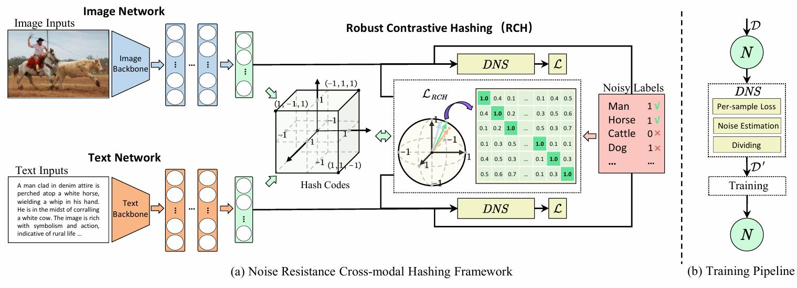
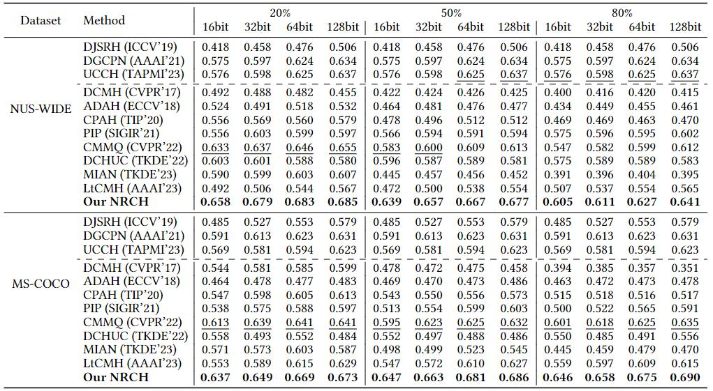
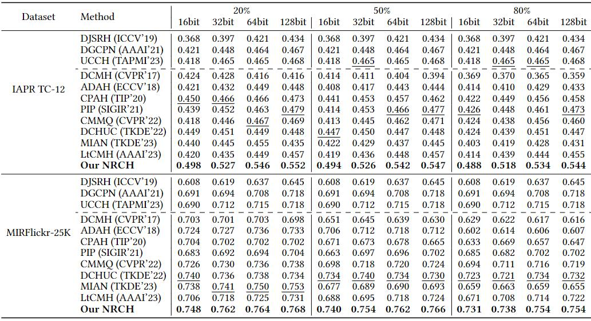

## Introduction
PyTorch implementation for Robust Contrastive Cross-modal Hashing with Noisy Labels. (ACM Multimedia 2024). 

## NRCH framework
The overview of our NRCH. (a) is the overall framework of our NRCH, which employs a cross-modal network $N=\{f_1,f_2\}$ to learn hashing with noisy labels. (b) is the training pipeline of our method. In NRCH, Robust Contrastive Hashing (RCH) leverages the homologous pairs rather than noisy positive ones and guides $N$ to learn unified hash codes across different modalities through convincing samples selected by Dynamic Noise Separator (DNS). To train the networks $N$ with convincing set $\mathcal{D}^{'}$, DNS discriminates the clean and corrupted labels in $\mathcal{D}$ dynamically by estimating their likelihood to be noise via the designed per-sample loss.


## Play with Our Model
Before running the main script, you need to generate the `.h5` file and the noise. To do this, run `tools.py` and `generate.py`:
```bash
python ./utils/tools.py
python ./noise/generate.py
```
Once the `.h5` file and noise are generated, you can run the main script `NRCH.py` to play with the model:
```bash
python NRCH.py
```
We have already provided the trained model under 50% noise in 64-bit on MIRFlickr-25K dataset.

## Experiment Results:


